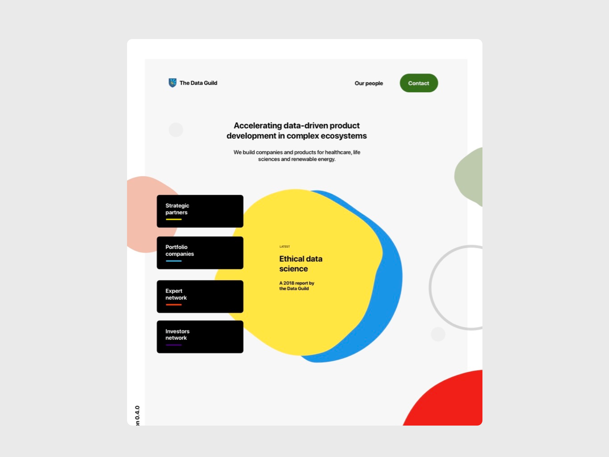
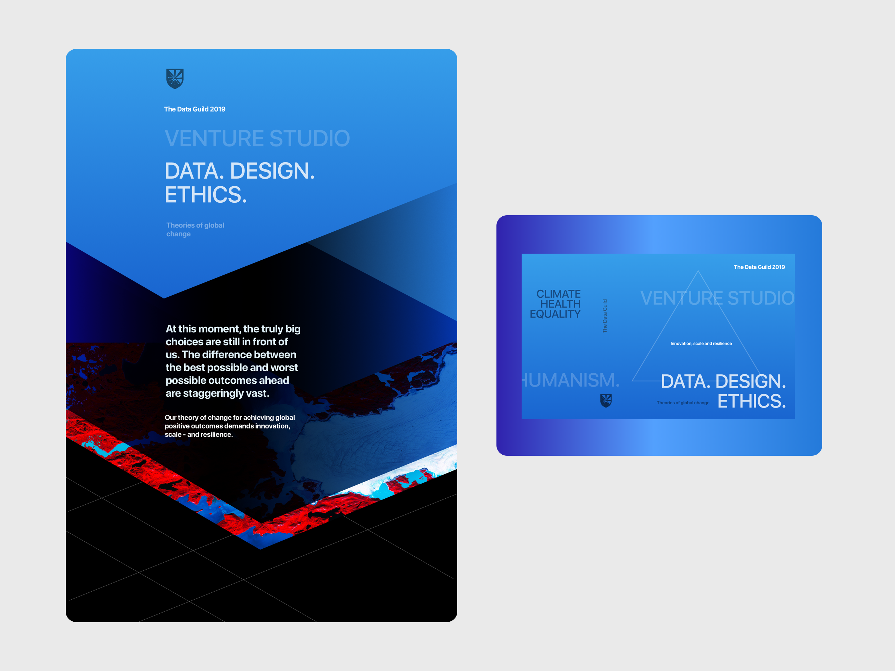

I am a lead member at [the Data Guild](https://thedataguild.com), a venture studio. At the Guild, I've supported data products in healthcare, life sciences, marketing, agriculture and climate change. I perform commercial product strategy and user experience engineering. 

At the Guild I have had the opportunity to work alongside world-class data scientists finding world-positive business models. We conceptualize and test new business models to find investable opportunity. 

The venture studio model is attractive because it situates companies in a community of builders. This helps de-risk the process and streamline the experimental flow.

The underlying questions facing any venture studio relate to allocation strategy and experiment design. What methodology do you use to arrive at consequential investment decisions? Can you learn how to invent a company — or how to carefully recruit an early stage founder? And once you have conceptualized a new product company, how do you evaluate its success? Which operators will staff the product? The Guild answers these questions by relying on a network of expert builders and a structured research cycle ("pods") to understand opportunities.

<aside>
  

    <h4>The Guild Experiment</h4>
    
    
Can a venture studio model exist with strong emphasis on climate and data ethics? The Guild's background in consulting on world-positive themes had helped build a network of experts who were aligned around this concept.
 
    
    
We've found it difficult to raise a significant fund which would allow the type of broad experimentation in climate, in spite of recent market enthusiasm for climate tech. See my colleague Beau's take on <a href="https://teetotality.blog/posts/climate-venture-studios/">Starting A Climate Studio</a>.

  

</aside>

At the Guild I have played a cross-functional role as a product strategist. I moved between products where user experience work was needed. I have often worked on the Guild itself, as seen in some of the example images below. I have also worked on Guild product experiments like [Faer](/faer) and [Layer](/layer).

