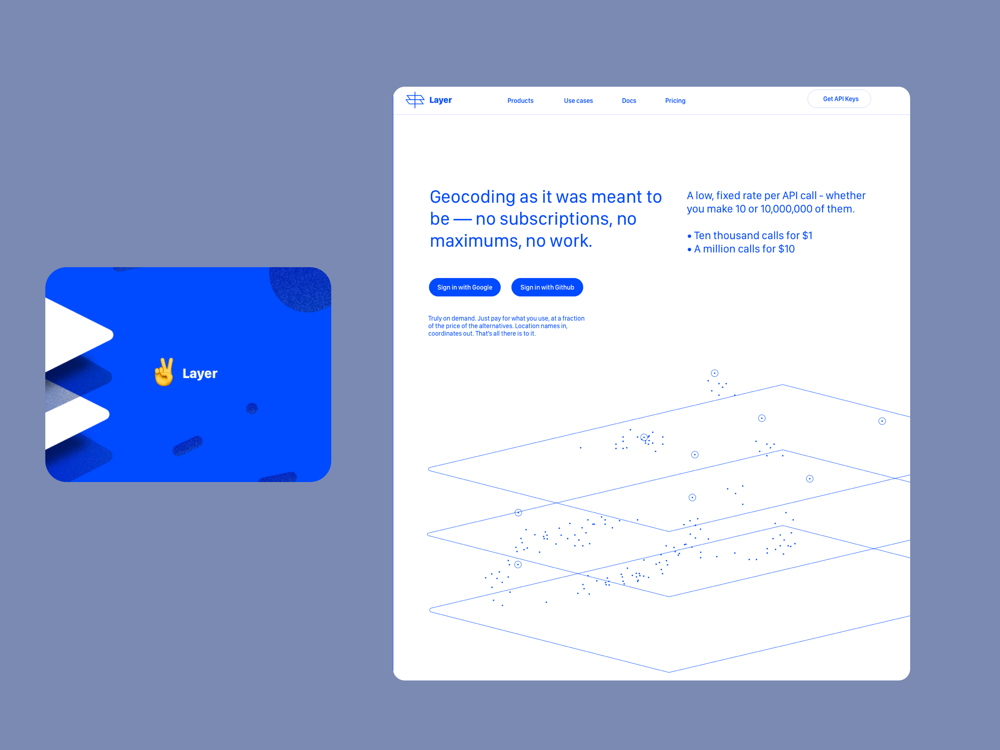
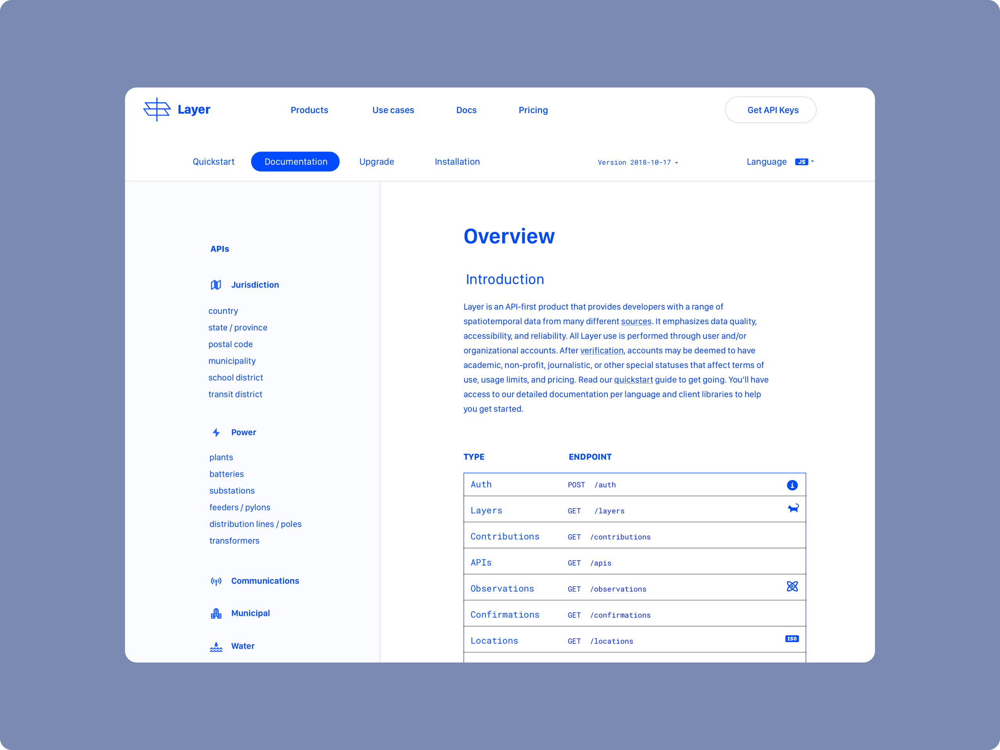

At the Guild we identified a class of low-touch products which worked well with the portfolio model — products which are data-driven, low-touch developer-facing tools that are horizontally relevant and can provide signal about market viability without a large sales team. An example of this type of product experiment was [Layer](/layer), which served as a API clearinghouse for general-purpose spatial data and geocoding services.

I led the UI design and frontend development, including authentication, integration with Stripe and the API backend. Users can create an API key and purchase credits for use by the API. 

The service was conceived as a low-touch data service which would create recurring revenue without a great deal of management overhead.

We have used Layer to measure market interest in API services. 

As a result we have created repeatable template for API service — and a recurring passive revenue stream.

