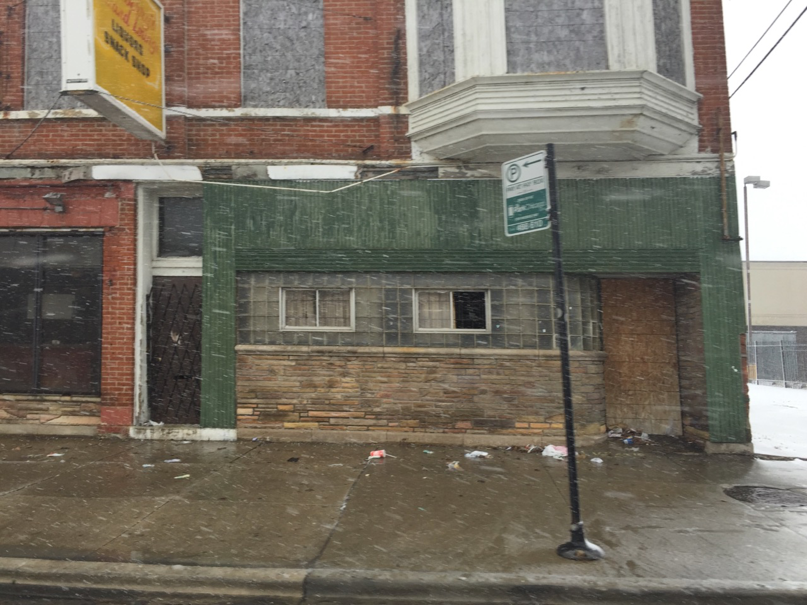

Disparities in health in the United States have grown, leaving some urban cores on par with undeveloped nations. The rate of chronic illness such as diabetes, asthma, sickle cell disproportionately affect those who lack access to broader social services such as education and a high quality food supply. Addressing the chronic health needs of urban cores requires a holistic examination of these social determinants of health. [UI Health in Chicago](https://hospital.uillinois.edu/) have developed an innovative technique for [Community Health Workers](https://www.cdc.gov/dhdsp/pubs/toolkits/chw-toolkit.htm) who are trained non-medical staff working with people their own communities. The health worker model provides an essential “concierge” support layer for those facing illness.

The foundational premise of the health worker model being piloted in Chicago is that hospital teams need front-line personnel who go into communities and work with patients in their homes to find counseling, perform medical routines, strategize about healthcare and find community resources.

Thus the core hypothesis of Faer is that these new types of healthcare teams will benefit from specialized communication tools. The Data Guild collaborated with UIC to develop a digital messenger product for addressing the specific needs of health workers in this context. 

I led the design process on the Faer project, which was conducted from February to July of 2016. I conducted in-context interviews and site visits to better understand the dynamics of the hospital, the patient's homes in Chicago.

Our Faer pilot showed that secure, stable messaging platform can help scale the efforts of health workers both internally to the health care team and externally while working directly with patients. 

There are numerous complex realities when dealing with hospital bureaucracy and underresourced urban populations. Automation and efficiency exist in tension with the sophistication and nuance of human care. Any software intervention in this context must be flexible enough to recede into the background behind the talented operation of a human operator, the health worker. Heavy-handed optimizations can threaten to disrupt a delicate relational balance between the health worker and the patient.

<!--  -->

