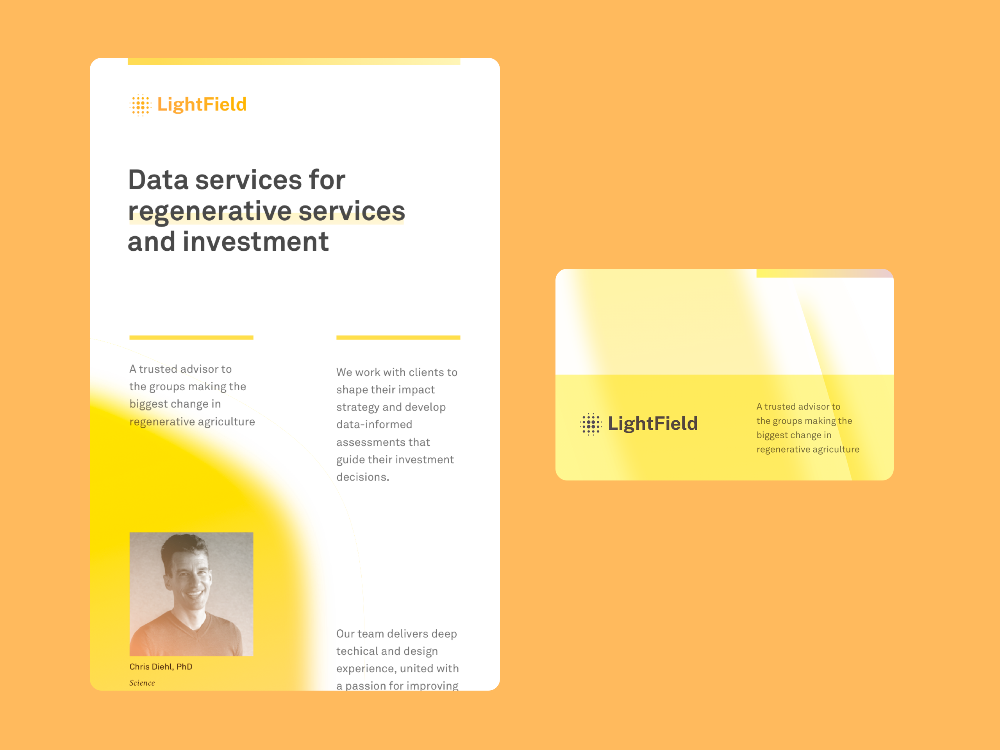
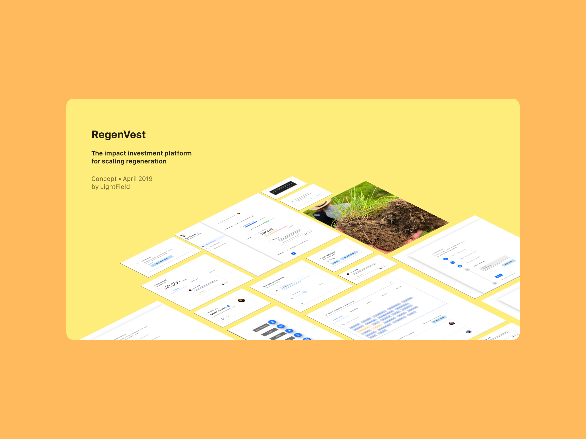

I co-founded <a href="https://lightfield.ag">LightField</a>, which is a data startup dedicated to improving agricultural practice through new financial mechanisms combined with organizational and social design.

LightField builds data-driven products that guide decision makers in identifying opportunities to invest in advancing a transition to [regenerative agriculture](https://en.m.wikipedia.org/wiki/Regenerative_agriculture).

We aim to accelerate the design and adoption of data-informed decision-making processes for multi-capital investment within the regenerative agriculture ecosystem.

Our clients are progressive investors in regenerative agriculture who currently reflect on the implications of their investment decisions for individuals, communities, and the environment. Their commitment to impact and continuous learning requires discipline and process. They believe in the power of data and technology to expand their capacity to uncover impactful investment opportunities and track evolving outcomes in their portfolio. They are ready to invest in new measurement and decision-making processes to expand the depth and breadth of their impact.  

