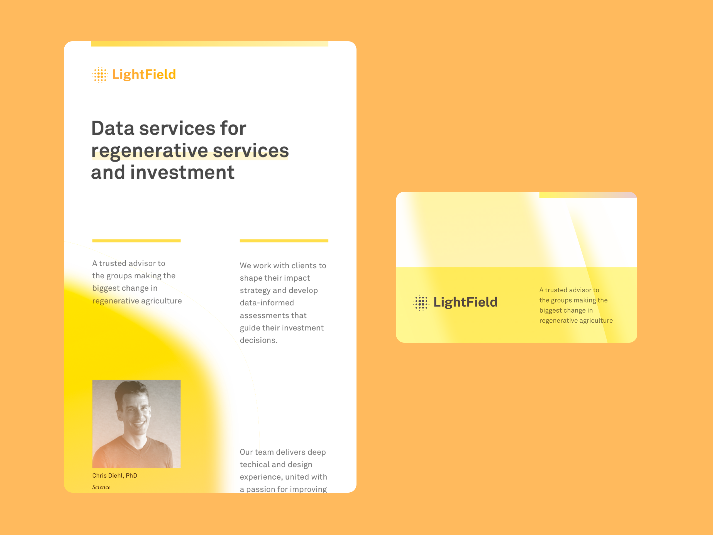

I co-founded LightField, which is a data startup dedicated to improving agricultural practice through new finanical mechanisms combined with organizational and social design.

LightField builds data-driven products that guide decision makers in identifying opportunities to invest in advancing a transition to [regenerative agriculture](https://en.m.wikipedia.org/wiki/Regenerative_agriculture). 

