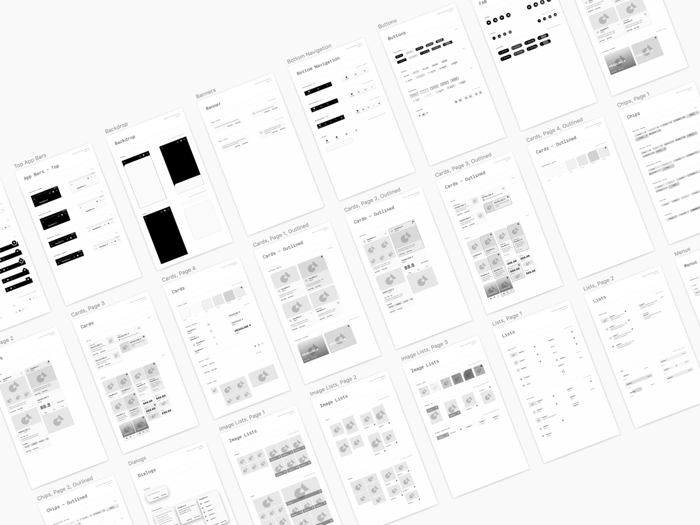
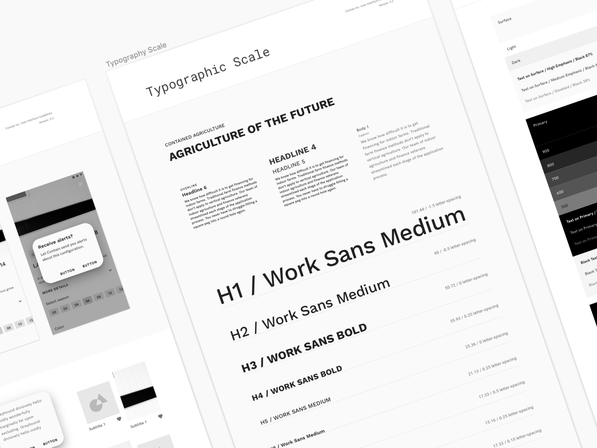

Contain is an fintech platform that matches farmers to financing, a kind of “Lending Tree for agriculture.” Contain focuses on serving indoor growers who have specific equipment needs and return profiles. For example, growing tomatoes in a greenhouse requires specific types of hardware for HVAC and water supply — and the tomato product will fetch a different rate on the open market. 

But indoor growing can be technology intensive and have a risk profile that confuses traditional lenders. This has created the market opportunity for a startup like Contain, which has deep experience in the field and can serve as a broker that adds meaningful value to upstream lenders who need to rationalize their lending process and downstream farmers who want to get the best rates and financial partners. Contain’s business model therefore relys on matching lender and farmer profiles. 

I think indoor agriculture is broadly significant becuase it uses approximately 1/10th of the resources in conventional agriculture, thus making it an important trend in human and ecological health. 

Contain also has a market strategy in insurance, since insurers are also looking to supplement their actuarial analysis in emergent domains.

I built the Contain platform during the TechStars 2019 accellerator. I used AWS (DyanmoDB, Cognito) for the backend APIs and React for the client code. I used a serverless approach that allows us to provision resources in a declarative, repeatable way.

