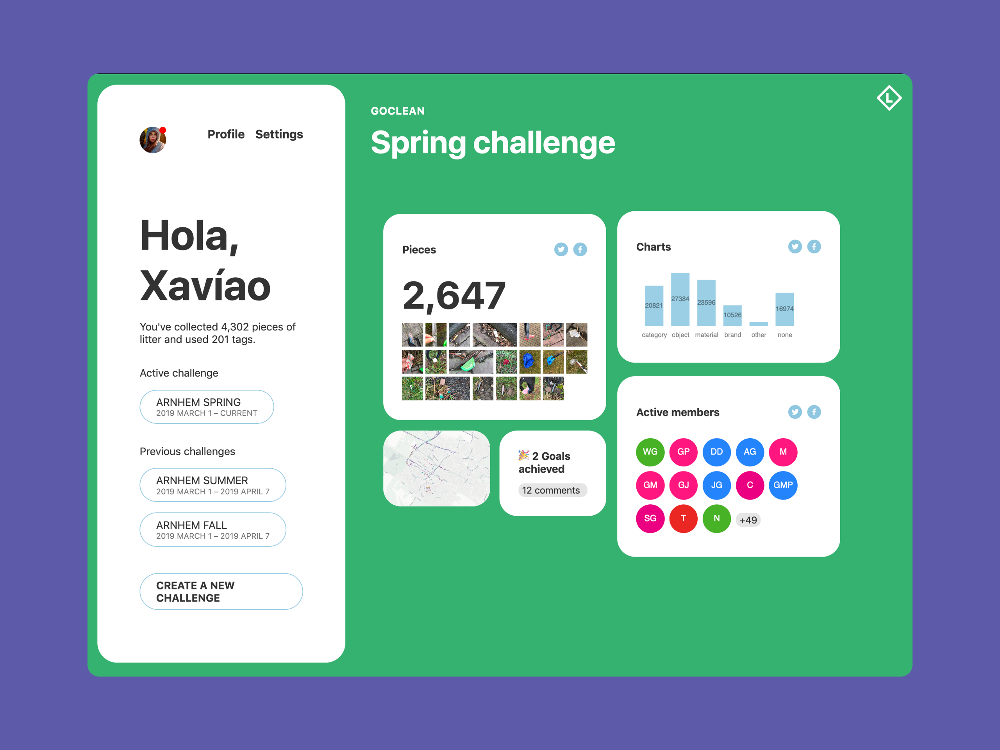

Litterati is a startup dedicated to community organizing for policy change. Litterati helps local teams of citizens organize to clean up beachfronts and urban areas. Users use an iOS or Android app to record images of the litter they collect; analysis of the litter data is used for strategic advocacy with governments and corporations. The Litterati app prominently uses machine learning to detect and automatically classify litter by brand, object type and material.

I have worked at Litterati as a data product strategist focused on optimizing data flow between team editors and a machine learning model. For my technical work with Litterati my tools are Node, Firebase a React frontend. I helped the team navigate a transition to open data licensing. I have also engaged at the executive strategic design process to support the development of positive feedback loops and network effects for growth.

