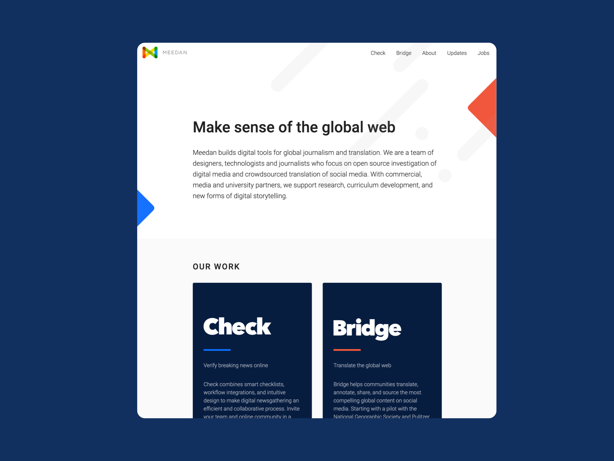

Meedan has a vision of a healthier, crosslingual internet. Meedan has worked with hundreds of people around the world to translate millions of words. Meedan is committed to the potential of translation as a social good, both at home and globally, with a particular focus on enabling communities to support global journalism and civic engagement.

I helped build [Meedan](https://meedan.com) from concept to a team of more than a dozen people, serving as Director of User Experience and Design. 

I am most proud of Meedan’s groundbreaking translation and counter-misinformation projects through flagship products [Bridge](/bridge) and [Check](/check). Meedan continues to enable new forms of cross-lingual collaboration. The guiding spirit of Meedan is to create self-aware network actors who are improving communication technologies; a beautiful example of a positive feedback loop. I am grateful to have worked so deeply in this process as a designer focused on what Doug Engelbart might call “improving the improving” through the development of freely available [usability test protocols](https://medium.com/meedan-updates/remote-usability-testing-with-invision-and-google-forms-126521d8779d) and [design standards](https://meedan-ui-guide.meedan.com/).

