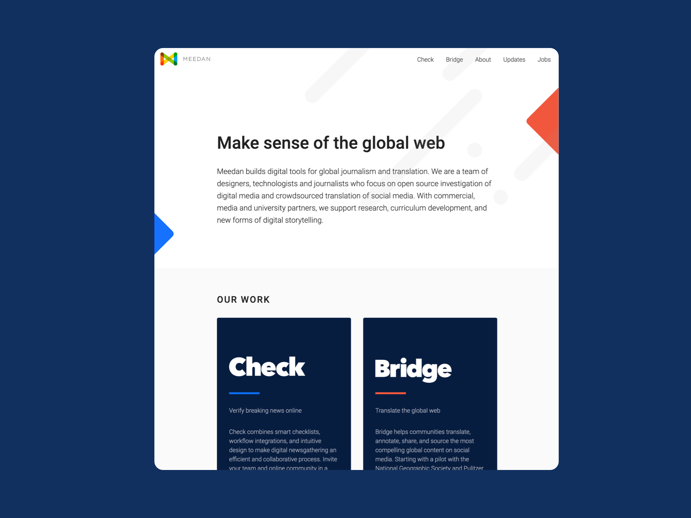
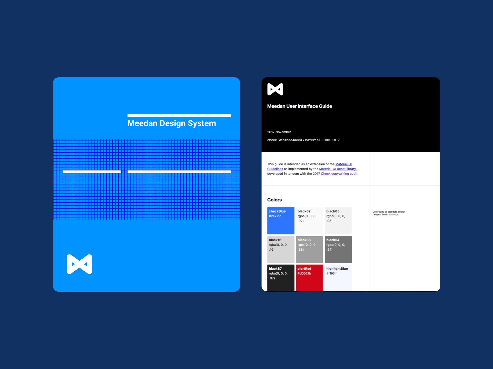
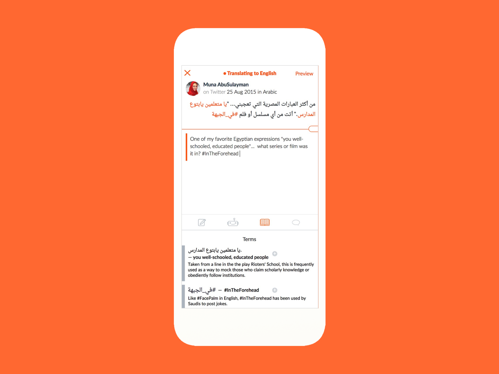
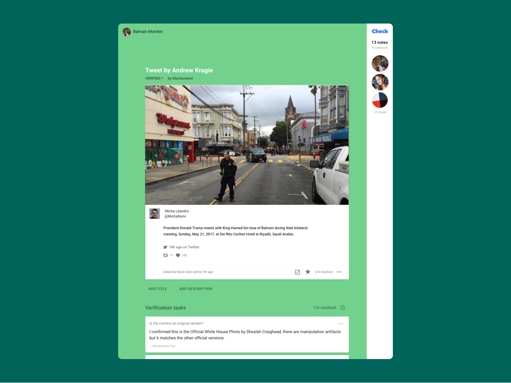

I helped build [Meedan](https://meedan.com) from concept to a team of more than a dozen people, serving as Director of User Experience and Design. Meedan is a vibrant mission-driven company with a vision of a healthier, cross-lingual internet. 

Meedan's key growth strategy has been to create a positive feedback loop of sophisticated advocates in journalism circles. I contributed to this process as a design manager focused on what Doug Engelbart might call “improving the improving” through the development of freely available [usability test protocols](https://medium.com/meedan-updates/remote-usability-testing-with-invision-and-google-forms-126521d8779d) and [design standards](https://meedan-ui-guide.meedan.com/). We closely listened to journalists and network actors who wanted translation tools, and in turn they used these tools in highly visible ways that drove new users to Meedan.

One of Meedan's flagship products is [Bridge](https://meedan.com/en/bridge), which enables rapid translation and annotation of social media to facilitate cross-cultural understanding.  

The core translation features of Bridge were initially developed in partnership with IBM around 2007, before the mature translation APIs like Google Translate existed. We built our own systems — including the world's first open source Arabic translation memory. Over the years we closely tracked market changes and evolved our product into a modern, hybrid human-machine approach that used mobile-first strategy and focused on social media. 

I led the interface design team throughout the growth of the product, working closely with domain experts in translation.

Our focus on translation led us to another market opportunity: If you are going to translate social media content, how do you know it is accurate and translation-worthy? 

Thus the second flagship product in the Meedan portfolio is [Check](https://meedan.com/en/check), a collaborative environment for digital verification work. Check combines smart checklists and workflow integrations to make digital newsgathering an efficient and collaborative process. Users create projects that contain suspicious media, and users contribute to helping to verify the media.

Check serves educational and enterprise clients with a focus on large newsrooms and integration contracts with social media networks.

Created in 2011, Check was an early leader in the media verification space, well before concerns about misinformation became front-page news in 2016. Our market strategy anticipated concerns about misinformation and earned partnerships across Latin America, North America, Europe, Africa, MENA and Asia as well as grants, consulting contracts and collaborations with groups like the AP, Mozilla, Twitter, Facebook and Google. 

