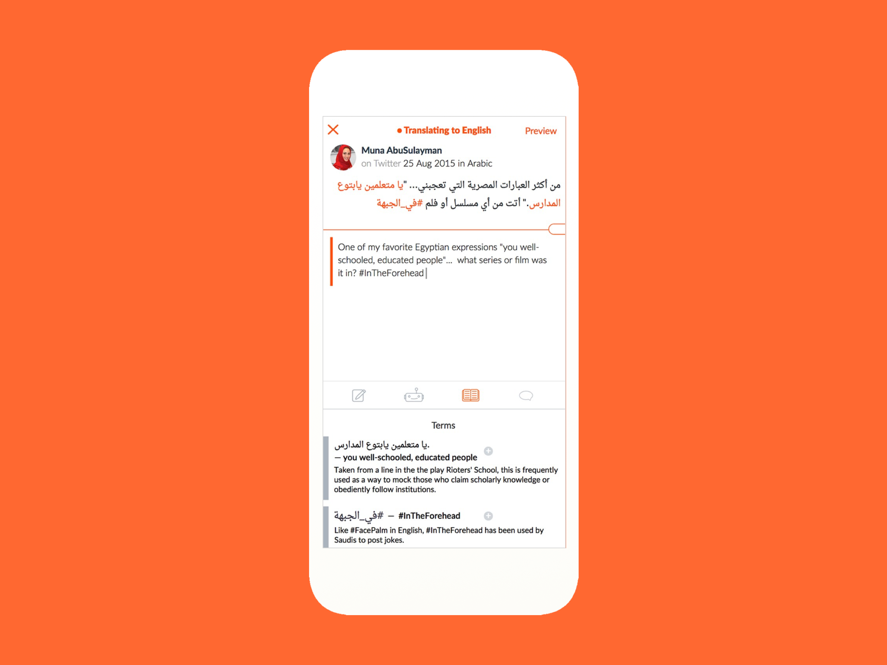

Bridge enables rapid translation of social media and the addition of important social and political annotations to facilitate cross-cultural understanding.  

The core translation features of Bridge were initially developed in partnership with IBM around 2007, before the mature translation APIs like Google Translate existed. Over the years we closely tracked market changes and evolved our product into a modern, hybrid human-machine approach that used mobile first strategy and focused on social media. 

I led the interface design team throughout the growth of the product, and working closely with domain experts in translation, business strategists.

Bridge helps translators work efficiently and with confidence in new domains by using dictionaries and glossaries. All translated content is portable, designed to be as seamless as sharing monolingual social media. Bridge has a strategy of creating new connections across linguistic, cultural and network divides.

The best translations involve a variety of skills — copy editing, grammar, spelling, a grasp of meaning and nuance. Bridge helps translators work collaboratively, with their individual contributions highlighted and recognized.

Bridge won grant support from the Knight Foundation and the National Geographic Society.

Bridge is used by groups like [Translators Without Borders](https://translatorswithoutborders.org/), and [Taghreedat](https://en.m.wikipedia.org/wiki/Taghreedat) for translation, research, and journalistic sourcing.