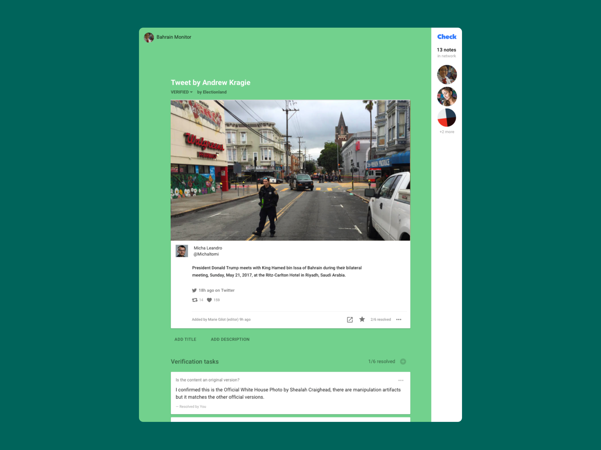

Check is a collaborative environment for digital work. Check combines smart checklists and workflow integrations to make digital newsgathering an efficient and collaborative process. It’s a (React, Rails, GraphQL, Postgres) web application. Users create projects that contain suspicious media, and users contribute to helping to verify the media.

The essential problem addressed by Check is: how can publishers work to verify large volumes of social media? Check serves educational and enterprise clients with a focus on large newsrooms.

The Check project has worked to build online tools, support independent journalists, and develop media literacy training resources that aim to improve the investigative quality of citizen journalism and help limit the rapid spread of rumors and misinformation online.

Founded in 2011, Check was an early leader in the media verification space, well before concerns about misinformation became front-page news in 2016. Check’s market strategy anticipated concerns about misinformation and become a flagship product for Meedan that has earned partnerships across Latin America, North America, Europe, Africa, MENA, South and South East Asia.

I led the user experience research and design of Check until 2016. Our key strategic insight was to take a platform approach — to incorporate a wave of emergent tools such as image search forensics into a unified workflow tool. We used the Check platform to help win contracts, partnerships and to find plugins that fit into our framework.

Meedan has used expertise from Check-related work to host workshops and panels, and was a founding member of the Google-backed [First Draft Coalition](https://www.niemanlab.org/2015/11/the-google-backed-first-draft-coalition-launches-a-site-to-help-journalists-verify-social-content/).

Check has been used as a collaborative workflow tool in both closed-source and crowd-sourced applications. For example Check was used by the [Bellingcat](https://t.co/rp4VxXEoNJ?amp=1) investigative team to support a [Europol anti-child-trafficking initiative](https://www.theguardian.com/world/2019/feb/04/picture-clue-cops-turn-to-amateur-web-sleuths-to-help-crack-cases). Check also helped coordinate [Electionland](https://medium.com/meedan-updates/checking-the-vote-how-check-was-used-during-electionland-4242dd875e4b), one of largest collaborations in US journalism. 

Based on the success of Check, Meedan founded the [Credibility Coalition](https://credibilitycoalition.org/), an interdisciplinary community committed to improving information ecosystems and media literacy through transparent and collaborative exploration, which earned investment and partnerships from the AP, Mozilla, Twitter, Facebook and Google.
