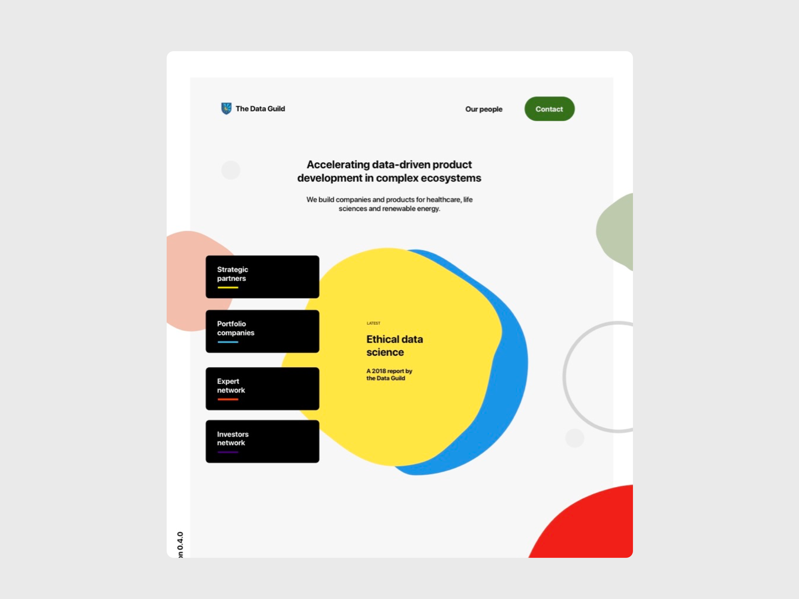

The Data Guild has developed my commercial strategy and product orientation. 

As a lead member of our venture studio, I have been responsible for a wide range activity in a data-intensive environment. A typical day at the Guild would involve business process design, business development, hiring strategy and client services. 

On a daily basis I focus on prototyping new technical capacity, production designs and business plans. 