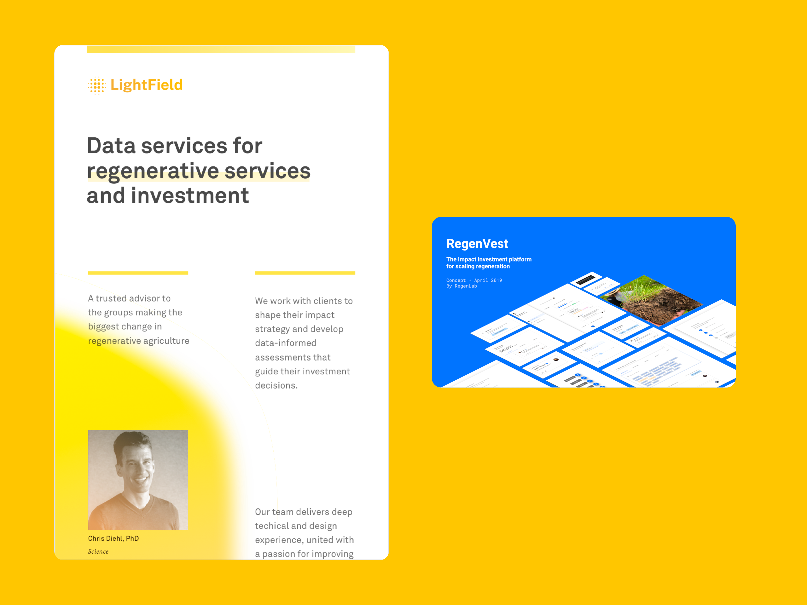

I co-founded LightField, which is a data startup dedicated to improving agricultural practice through new finanical mechanisms combined with organizational and social design.

LightField builds data-driven products that guide decision makers in identifying opportunities to invest in advancing the regenerative transition. 