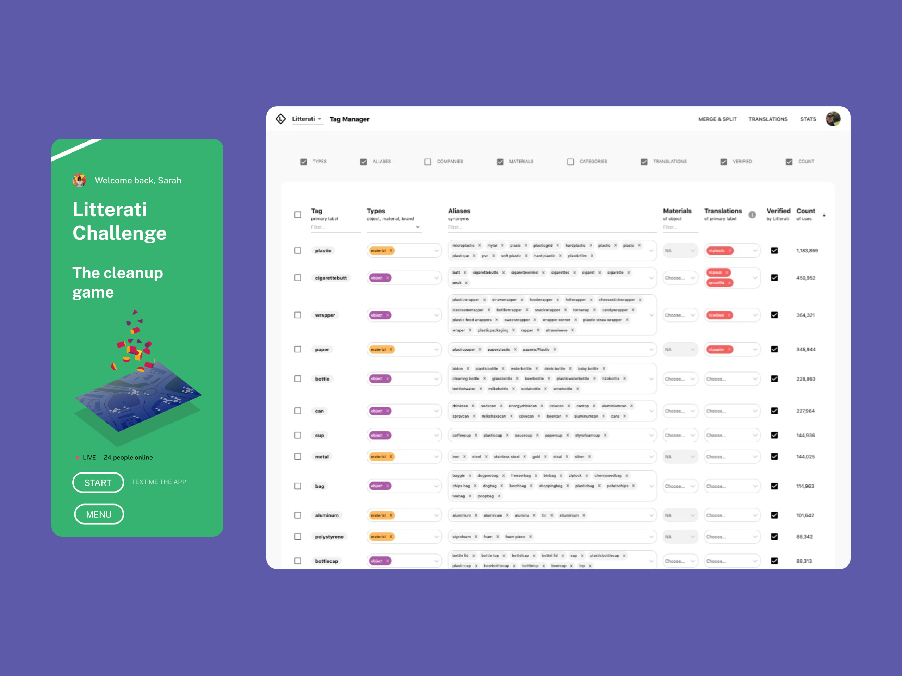

Litterati is an environmental startup dedicated to community organizing for policy change. Litterati helps local teams of citizens organize to clean up beachfronts and urban areas. Users use an iOS or Android app to record images of the litter they collect; analysis of the litter data is used for strategic advocacy with governments and corporations. The Litterati app prominently uses machine learning to detect and automatically classify litter by brand, object type and material.

I have worked at Litterati as a data product strategist focused on optimizing data flow between team editors and a machine learning model. 

To help train the machine learning model, I developed an data table interface so that Litterati editors can manage tags that have been applied by users.

I also developed an information dashboard for users to see how their teams are progressing and to give an organization-wide view of the data being collected. 

I have also helped the team navigate a transition to open licensing.

For my technical work with Litterati I rely on Node scripts, a Firebase backend and a React frontend.

