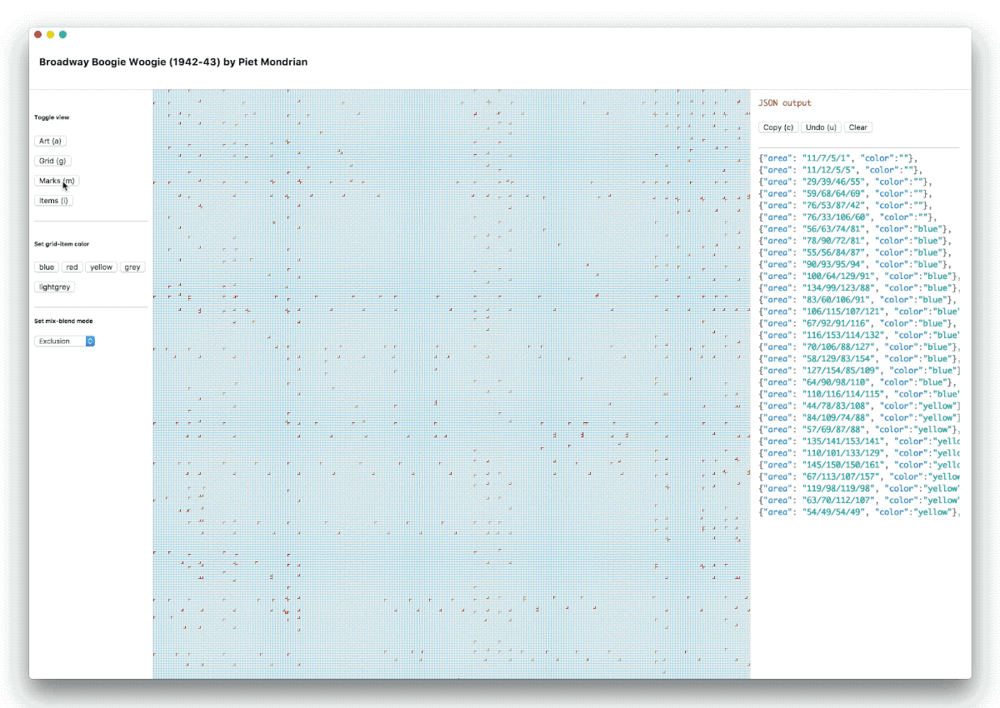

import { GifWrap } from 'components/GifWrap'
import { FinePrint } from 'styles/styles'

Zag is an experimental CSS grid editor that can be installed as a MacOS app. I wrote it over a weekend just as an exploration and meditation a particular artwork by Mondrian. It is useful for creating large CSS layouts that use hundreds or thousands of gridlines, perhaps for artistic purposes such as accurately tracing a Mondrian artwork, as shown below. My main reason for fussing with this side project was to explore modes of a cross-platform, installable desktop app. I also enjoyed finding some clever approaches to rendering large grids in React — grids larger than the Firefox grid debugger could handle.

<GifWrap>



</GifWrap>
<FinePrint>Zag, my first MacOS app</FinePrint>

### Design spirit

For this personal project, I needed a utilitarian tool that would help me achieve a specific artistic technical goal: I needed an artwork underneath that I could trace, a set of gridlines on top to help me see how the artwork aligned to the grid, and feedback during mouse events so I could accurately — very accurately — draw the grid items.

I chose a three pane workbench style with utility buttons on the left and a console of JSON output on the right. I embraced the native buttons, interaction patterns and typography to help it feel integrated into the MacOS universe. I wanted a reduced palette to ensure the artwork stood out for inspection. 


### Implementation

Zag runs on MacOS in an Electron shell, essentially a bloated Chrome instance, which is fine for these purposes. I think it's amazing to be able to use React JSX for layout and Styled Components for styling in a desktop app, even if it is early days with such magic.

An interesting part: how to draw gridlines? A clever solution involves repeating linear gradients, like so: 


```jsx
const rowGradient = `
  to bottom,
  ${ephemeralColor},
  transparent ${lineThickness},
  transparent ${gridUnit}
`

const columnGradient = `
  to right,
  ${ephemeralColor},
  transparent ${lineThickness},
  transparent ${gridUnit}
`

export const GridVisual = styled.div`
  position: absolute;
  width: ${gridWidth};
  height: ${gridHeight};
  opacity: ${props => (props.visibleGrid ? '1' : '0')};
  transition: opacity ${transitionSpeedDefault};
  background-image: repeating-linear-gradient(${columnGradient}),
    repeating-linear-gradient(${rowGradient}); // <— This is the interesting part
  background-size: 100% 100%;
  background-position: 0;
  pointer-events: none;
  z-index: 1;
  mix-blend-mode: multiply;
`
```

Another interesting aspect was how to draw an `EphemeralRectangle` that only appeared while the mouse was down. It becomes transparent on `mouseUp`: 

```jsx
const EphemeralRectangle = props => {
  const boxDrawn = `${props.firstCoordinates}/${props.secondCoordinates}`
  return (
    <div
      style={{
        position: 'relative',
        visibility: 'visible',
        backgroundColor: props.drawing ? 'transparent' : ephemeralColor,
        border: `1px solid ${props.drawing ? 'aqua' : 'transparent'}`,
        gridArea: boxDrawn,
        transition: 'background-color, 1s, border-color, 1s',
      }}
    >
      <Centered>
        <LabelSecondary>{boxDrawn}</LabelSecondary>
      </Centered>
    </div>
  )
}
```

A key part of the app is having a central way to persist the grid data. I store `gridItems` in localStorage as an array of objects. So this can then be used to draw the grid multiple times — allowing some interesting effects with `mix-blend-mode`. (Which is chosen from a dropdown, stored in state and then used in a styled component.)

```jsx
  export const gridItems = `[
  {"area": "1/7/80/12", "color": "yellow" },
  {"area": "1/15/-1/20", "color": "yellow" },
  {"area": "1/29/-1/34", "color": "yellow" },
  {"area": "1/55/-1/60", "color": "yellow" },
  {"area": "1/130/-1/136", "color": "yellow" },
  // repeat for a bazillion grid items
  ]`
```

I found a good trick for drawing the baseline grid (like graph-paper underneath) while ensuring it aligned with the CSS grid items on top. The key was to reuse a shared `gridUnit`: 

```jsx
  // Convert pixels to larger grid units
  export function convertToGrid(y, x) {
    return `${Math.floor(y / stripUnit(gridUnit)) + gridOffset}/${Math.floor(
      x / stripUnit(gridUnit)
    ) + gridOffset}`
  }
```

And I learned that copying to the clipboard has a simple API — though it felt hackish to manipulate the DOM directly, I should probably rewrite this with a proper ref: 

```jsx
  export function copyToClipboard(str) {
    const el = document.createElement('textarea')
    el.value = str
    document.body.appendChild(el)
    el.select()
    document.execCommand('copy')
    document.body.removeChild(el)
    console.log(`Copied ${str}`)
  }

```

Keyboard shortcuts were implemented with react-hotkeys, which was a bit fussy (I probably should have implemented it myself) but it has a super readable configuration:

```jsx
  const hotkeyHandlers = {
    c: this.handleCopy,
    a: this.artToggle,
    g: this.gridToggle,
    u: this.handleUndo,
    m: this.marksToggle,
    i: this.gridItemsToggle,
    esc: this.ephemeralRectangleClear,
  }
```

With the grid data persisted in localStorage, I can render grids in CSS and the HTML needed to create an element in the DOM. Then various configuration options are tracked in state and passed into the components. Here's a snippet of how that looks inside the main grid component:

```jsx

  {visibleMarks, visibleGridItems, mixBlendMode, firstCoordinates, secondCoordinates, drawing} = this.props

  <GridPrimary
    visibleMarks={visibleMarks}
    visibleGridItems={visibleGridItems}
    mixBlendMode={mixBlendMode}
  >
    <EphemeralRectangle
      firstCoordinates={firstCoordinates}
      secondCoordinates={secondCoordinates}
      drawing={drawing}
    />
    {GridItemsAsHTML}
  </GridPrimary>
  
```

Then I can render thousands of grid items programmatically! Fun. ... Not super useful to anyone but me perhaps (does anyone really _need_ thousand-part grids?) But a fine way to spend the weekend.

```jsx
  const GridItemsAsHTML = JSON.parse(gridItems).map((item, index) => (
    <Item
      key={index}
      style={{
        position: 'relative',
        gridArea: item.area,
        backgroundColor: colors[item.color],
      }}
    >
      {this.props.visibleMarks && [
        <TopLeftMark key={index + 'a'}>
          {topLeftCoordinates(item.area)}
        </TopLeftMark>,
        <BottomRightMark key={index + 'b'}>
          {bottomRightCoordinates(item.area)}
        </BottomRightMark>,
      ]}
    </Item>
  ))
```

You can find the code on [github](https://github.com/christopherfrance/zag).