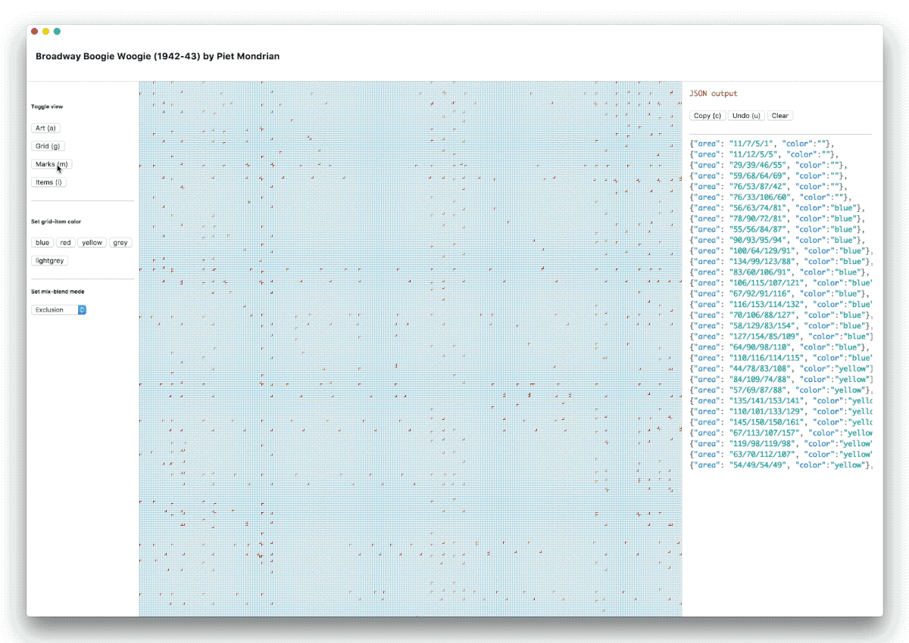

import { GifWrap } from '../../src/components/GifWrap'

Zag is an experimental CSS grid editor. It is useful for creating large CSS layouts that use hundreds or thousands of gridlines, perhaps for artistic purposes such as accurately tracing a Mondrian artwork, as shown below.

<GifWrap>



</GifWrap>

### Implementation

Zag is a desktop app that runs on MacOS in an Electron shell.

```js
(function() {

var cache = {};
var form = $('form');
var minified = true;

var dependencies = {};

var treeURL = 'https://api.github.com/repos/PrismJS/prism/git/trees/gh-pages?recursive=1';
var treePromise = new Promise(function(resolve) {
	$u.xhr({
		url: treeURL,
		callback: function(xhr) {
			if (xhr.status < 400) {
				resolve(JSON.parse(xhr.responseText).tree);
			}
		}
	});
});
```